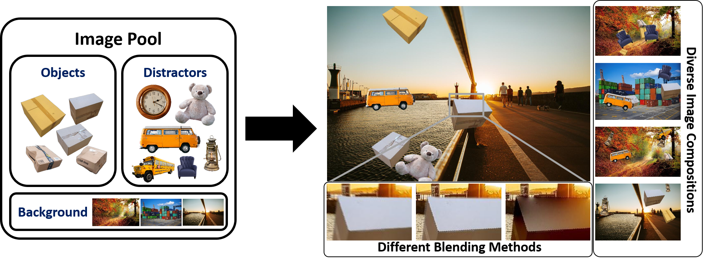

[](https://github.com/a-nau/synthetic-dataset-generation/actions)
[](https://github.com/debidatta/syndata-generation)
[](https://arxiv.org/abs/2210.09814)
[](https://a-nau.github.io/parcel2d)

# Synthetic Dataset Generation

> This repository is a modified (and extended) version
> of [debidatta/syndata-generation](https://github.com/debidatta/syndata-generation), which
> hopefully is more convenient to use. All credits to the original authors (also see [Citation](#citation)).
>
<p align="center">
    
    <br>
    <span style="font-size: small">
      <b>Figure:</b> 
      Minimal dataset example of 5 images where only assets from the <a href="data/readme.md">image pool</a> were used.
    </span>
    <br>
</p>

This repo helps you to very easily create your own instance segmentation dataset rapidly. What do you need?
The relevant resources, i.e. an image pool of

- background images (any sizes)
- objects of interest (in RGBA format)
- distractor objects (in RGBA format)
- splits for training, validation and test (of your resources) as described [here](data/readme.md)

The rest will be handled by this repository :) If you need help gathering data for the image pool, check
our [project page](https://a-nau.github.io/parcel2d/) with details on image scraping and asset selection.

This version was developed as part of a [paper](https://arxiv.org/abs/2210.09814) ([citation](#citation)), also check
the [project page](https://a-nau.github.io/parcel2d/) for more details.

## Usage

There two places to make configurations:

[config.py](src/config.py) to adjust e.g. (all variables are explained in the comments)

- number of objects of interests
- number of distractors
- max IoU between objects
- which blending methods are used
- ... (see [config.py](src/config.py))

[generate_synthetic_data.py](src/tools/generate_synthetic_data.py) to set

- paths to the resources needed for dataset generation (also see [Data](data/readme.md))
- number of images that should be generated
- flags for enabling occlusion, rotation and scaling
- flag for multithreading for faster image generation (recommended)

### Locally

Install the requirements

```shell
pip install -r requirements.txt
```

And run

```shell
python src/tools/generate_synthetic_data.py
```

### Docker

Build using

```shell
source scripts/docker_build.sh           # for CPU
source scripts/GPU/docker_build.sh       # for GPU (faster Poisson Blending)
```

Run dataset generation using

```shell
source scripts/docker_run.sh             # for CPU
source scripts/GPU/docker_run.sh         # for GPU (faster Poisson Blending)
```

Please check the respective files, in order to make any changes.

## Citation

If you use this code for scientific research, please consider citing the following two works.

### Cut, Paste and Learn: Surprisingly Easy Synthesis for Instance Detection

The original work, including the [code](https://github.com/debidatta/syndata-generation) on which this repository is
built. Thanks a lot to the authors for providing their code!

```latex
@inproceedings{Dwibedi_2017_ICCV,
	title        = {Cut, Paste and Learn: Surprisingly Easy Synthesis for Instance Detection},
	author       = {Dwibedi, Debidatta and Misra, Ishan and Hebert, Martial},
	year         = 2017,
	month        = {Oct},
	booktitle    = {The IEEE International Conference on Computer Vision (ICCV)}
}
```

- Paper: [arxiv](https://arxiv.org/abs/1708.01642)
  and [ICCV 2017](https://openaccess.thecvf.com/content_ICCV_2017/papers/Dwibedi_Cut_Paste_and_ICCV_2017_paper.pdf)

### Scrape, Cut, Paste and Learn: Automated Dataset Generation Applied to Parcel Logistics

Our work for which this repository was developed.

```latex
@inproceedings{naumannScrapeCutPasteLearn2022,
	title        = {Scrape, Cut, Paste and Learn: Automated Dataset Generation Applied to Parcel Logistics},
	author       = {Naumann, Alexander and Hertlein, Felix and Zhou, Benchun and Dörr, Laura and Furmans, Kai},
	booktitle    = {{{IEEE Conference}} on {{Machine Learning}} and Applications ({{ICMLA}})},
	date         = 2022
}
```

## Affiliations

<p align="center">
    
</p>